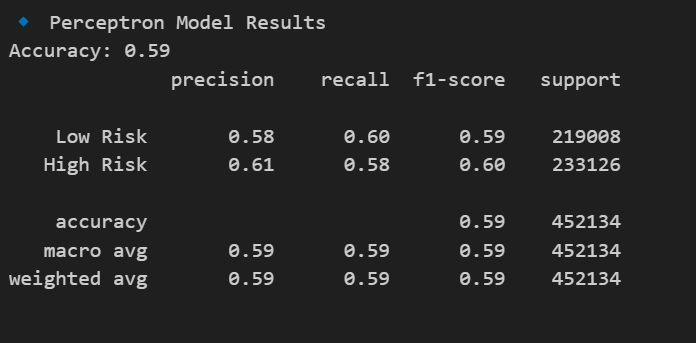
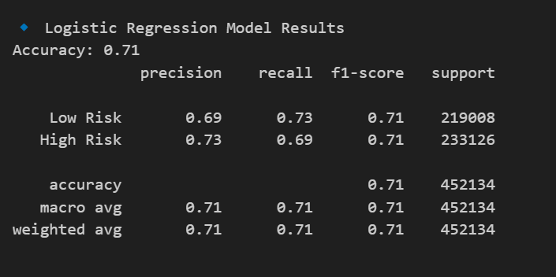
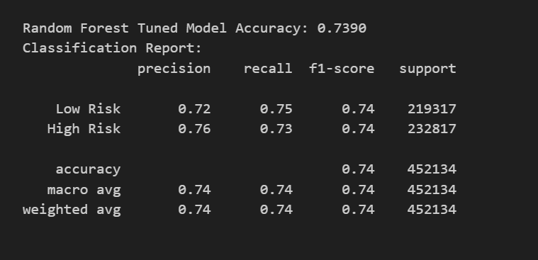

# Fintech Loan Prediction

## “Predicting Personal Loan Risk Level by Analyzing Borrower Financial History, Credit Worthiness and Desired Loan Configurations”

**Industry**: Finance / Fintech

---

## Problem Statement

In today's fast-paced lending market, competition is fierce. Emerging fintech platforms, P2P lending, and DeFi have lowered entry barriers for non-traditional lenders. To stay competitive, lenders must vet, price, and approve loans rapidly and accurately.

Traditional lenders are slowing down due to increased regulation, opening up opportunities for agile fintechs. A robust predictive model to assess loan quality and default risk is essential for managing risk exposure and gaining a competitive edge.

---

## Project Goals

- Streamline approval processes for low-risk loans
- Assign fair pricing tiers (interest rates) based on predicted risk
- Flag and monitor high-risk loans for portfolio management

---

## Process Overview

- Use borrower financial data (income, credit score, DTI, defaults, etc.)
- Analyze loan details (term, amount, purpose)
- Perform visual exploration to uncover key trends
- Build a predictive model to assign loan risk level
- Optionally, flag already-issued loans with high default risk for monitoring

---

## Objectives

- Clean and analyze real-world Lending Club 2018 loan data
- Visualize key financial behaviors and credit trends
- Train and optimize classification models (Random Forest, XGBoost, Neural Networks)
- Handle class imbalance using SMOTE and class weighting
- Track model performance with precision, recall, F1-score, and confusion matrix

---

## Dataset

**Source**: Lending Club (via Kaggle)  
https://www.kaggle.com/code/faressayah/lending-club-loan-defaulters-prediction
**Sample size**: ~1 million personal loan records  
**Features**: income, loan amount, DTI, employment status, loan purpose, loan grade, and mor

---

## Project Steps

### 1. Data Cleaning
- Reduced original 145 columns to 27 relevant features
- Removed null values and duplicates
- Handled outliers (e.g., income > $1M)

### 2. Exploratory Data Analysis (EDA)
- Visualized distributions of income, loan amount, DTI, interest rate, loan grades
- Used heatmaps, boxplots, and bar plots to identify correlations
- Confirmed class imbalance (fewer high-risk loans)
- Final cleaned dataset saved as `df_subset.csv`

### 3. Database Schema
- Created schema in PostgreSQL
- Uploaded cleaned data to AWS RDS

### 4. Data Preprocessing
- Encoded categorical variables using `get_dummies()`
- Bucketed values to smooth distributions
- Scaled numeric values with `StandardScaler`

### 5. Modeling
- Models Used:
  - Random Forest Classifier
  - XGBoost Classifier
  - Neural Network (Keras)
- Target: `loan_grade_grouped`  
  (Low Risk = Grades A/B, High Risk = Grades C–G)
- Split: 80/20 training/test
- Best Accuracy: ~74%
- Metrics: Accuracy, Precision, Recall, F1, Confusion Matrix

### 6. Optimization & Class Imbalance Handling
- Handled imbalance using:
  - SMOTE
  - Class weighting
- Hyperparameter tuning:
  - Tree depth, estimators, activation functions
  - Epochs, batch size (NN)
- Incorporated `SimpleImputer` and consistent scaling

### 7. Model Outputs
### Model Evaluation and Selection

To classify loans as either Low Risk (Grades A/B) or High Risk (Grades C–G), we tested and compared four supervised machine learning models. Our pipeline included preprocessing steps such as handling missing values, one-hot encoding categorical variables, feature scaling, and applying SMOTE to address class imbalance.

**1. Sequential Neural Network**
- A multi-layer neural network was trained to capture complex, non-linear relationships.
- Despite balancing the classes with SMOTE, the model achieved only ~52% accuracy.
- The model overfitted to the majority class and failed to generalize, likely due to insufficient signal in the features or
- suboptimal architecture.

**2. Perceptron**
- Used as a simple linear baseline model.
- Achieved ~59% accuracy with near-equal precision and recall for both classes.
- While better than the neural network, it lacked the capacity to capture non-linear relationships or complex feature interactions.

**3. Logistic Regression**
- Provided a strong linear benchmark after applying SMOTE to balance the classes.
- Achieved ~71% accuracy, with well-balanced precision and recall (~0.71 F1-score).
- Demonstrated reliable performance with fast training and interpretability.
 

**4. Random Forest with SMOTE and Hyperparameter Tuning**
- The optimized Random Forest model achieved an accuracy of **73.9%** on the test set.  
- Both Low Risk and High Risk classes showed balanced precision and recall (F1-score ≈ 0.74).  
- The model was trained using SMOTE for class balancing and tuned with RandomizedSearchCV for   improved generalization.
 

 **Conclusion**: Random Forest with with SMOTE and Hyperparameter Tuning is selected as the final model for deployment due to its superior performance, balanced metrics, and ability to model non-linear patterns in the data.

---

## Technologies Used

- Python, Jupyter, Google Colab
- pandas, numpy for data processing
- matplotlib, seaborn, plotly for data visualization
- scikit-learn, xgboost, keras for machine learning and deep learning
- imbalanced-learn for handling class imbalance with SMOTE
- joblib and SQLAlchemy for model saving and database integration
- psycopg2 to create direct connection with AWS
- Gradio for interactive ML interface
- PostgreSQL on AWS RDS for relational database storage
- AWS for cloud hosting and database services

---

## Repository Structure
Loan-Prediction/
├── Resources/zip files, csv
│── Visual   
├── models 
├── notebooks/
│   ├── final/data_creating_colab.ipynb,
|   └── All_other_model_attempts
│   └── EDA_and_cleaning/cleaning.ipynb,EDA_Loan_Data_colab
├── README.md
├── db_config.json
└── .gitignore
└── Gradio_rf_app.py
└── Presentation

---

## Next Steps (Future Work)

- Use a larger dataset and advanced balancing techniques
- Integrate real-time credit bureau API (e.g., Equifax) for live scoring
- The final Random Forest model was integrated with a Gradio app for real-time prediction. While the interface works as expected, there are some performance limitations — 
  particularly in accurately classifying high-risk loans.

---
## Challenge with Uploading Large Dataset

We were unable to upload the CSV file directly to GitHub due to its large size.  
You can download the dataset using the link below:
https://drive.google.com/drive/folders/1KnrpDU1dHtPM2-nAvFlVZP6dVamjLTpq?usp=drive_link

## License

Project 4 – Data Analytics Boot Camp – University of Toronto  
For educational purposes only

---

## Team

- Seyhr Waqas  
- Asif Shahzad  
- José Traboulsi  
- Karla Lopez Marin
